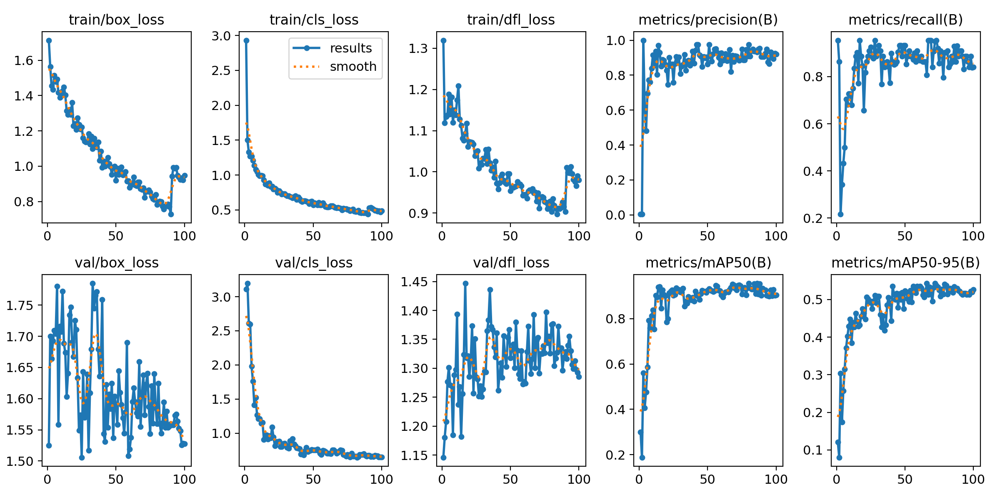
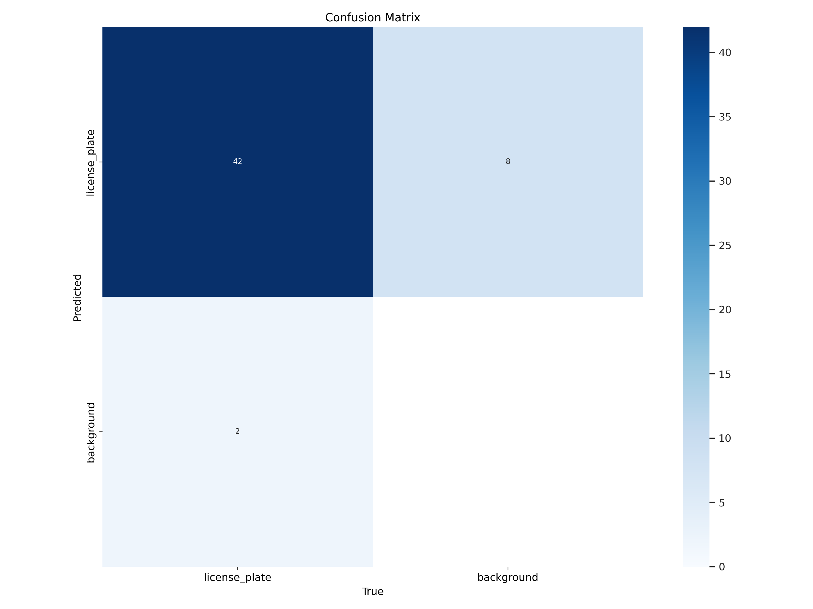

# License Plate Detection Project

## Overview

This project focuses on detecting license plates in images and videos using a YOLOv8 (You Only Look Once version 8) model. The model was trained using a dataset from Kaggle and has been deployed using Streamlit for ease of use. The application supports image and video inputs and provides bounding boxes around detected license plates.

## Dataset

The dataset used for training the model is the [Car Plate Detection Dataset](https://www.kaggle.com/datasets/andrewmvd/car-plate-detection) available on Kaggle. This dataset contains a variety of images with annotated car license plates, which is ideal for training a robust detection model.

## Directory Structure

The directory structure prepared for training the model on Kaggle Notebooks is as follows:

```
cars_license_plate_new/
│
├── test/
│   ├── images/          # Test images
│   └── labels/          # Test labels
│
├── train/
│   ├── images/          # Training images
│   └── labels/          # Training labels
│
└── val/
    ├── images/          # Validation images
    └── labels/          # Validation labels
```

## Model Training

### Data Preparation

The data preparation involves the following steps:

1. **Extracting Annotations**: Parsing XML files to extract bounding box annotations.
2. **Splitting Dataset**: Dividing the dataset into training, validation, and test sets.
3. **Preprocessing Images**: Resizing and normalizing images to fit the YOLOv8 model requirements.

### Training Process

The YOLOv8 model was trained using the following configurations:

1. **Framework**: PyTorch was used for model training.
2. **Training Duration**: The model was trained for 100 epochs.
3. **Hyperparameters**: Standard YOLOv8 hyperparameters were used with some tuning.
4. **Weights and Biases**: Used for tracking experiments, visualizing model performance, and managing hyperparameters.

### Training Results

The training results, including the loss curves and evaluation metrics, are shown below:





## Deployment

The trained YOLOv8 model is deployed using Streamlit Cloud, a Python library that makes it easy to create and share custom web applications. The deployed application allows users to upload images or videos and receive bounding boxes around detected license plates.

You can access it right here: 
[License Plate Detection](https://licenseplatedetectionn.streamlit.app/)

### Streamlit Application

The Streamlit application includes the following features:

1. **File Upload**: Allows users to upload images (JPG, PNG, JPEG) or videos (MP4, MKV, AVI, MOV).
2. **Model Loading**: Loads the trained YOLOv8 model.
3. **Processing**: Processes the uploaded file and displays the result with bounding boxes around detected license plates.

## Features

- **Image Input**: Users can upload images in JPG, PNG, or JPEG formats.
- **Video Input**: Users can upload videos in MP4, MKV, AVI, or MOV formats.
- **Output**: The application processes the input and provides bounding boxes around detected license plates.

## Installation

To run the application locally, follow these steps:

1. Clone the repository:
   ```bash
   git clone https://github.com/tushtivverma/License_Plate_Detection.git
   cd license-plate-detection
   ```

2. Install the required dependencies:
   ```bash
   pip install -r requirements.txt
   ```

3. Run the Streamlit application:
   ```bash
   streamlit run yolo_application.py
   ```

## Usage

1. Open the Streamlit application in your web browser (typically at `http://localhost:8501`).
2. Upload an image (JPG, PNG, JPEG) or a video (MP4, MKV, AVI, MOV).
3. Wait for the model to process the input.
4. View the output with bounding boxes around detected license plates.

## Project Structure

```
license-plate-detection/
│
│
├── model/
│   └── yolov8/            # YOLOv8 model file
│ 
├── Images_Video/
│   └── demo.mp4/          # demo video file
│   └── demo.img/          # demo image file
│
├── app.py                 # Streamlit application
├── train.ipynb            # Script for training the model
├── requirements.txt       # Python dependencies
├── temp                   # save the image
└── README.md              # Project documentation


```

## Contributing

Contributions are welcome! Please feel free to submit a Pull Request.

## License

This project is licensed under the MIT License. See the `LICENSE` file for more details.

## Acknowledgments

- [Kaggle](https://www.kaggle.com/) for providing the dataset.
- [YOLO](https://pjreddie.com/darknet/yolo/) for the detection framework.
- [Streamlit](https://streamlit.io/) for the web application framework.
- [Weights & Biases](https://www.wandb.com/) for experiment tracking and visualization.

---

Feel free to reach out with any questions or feedback!

---

Happy coding! 🚀